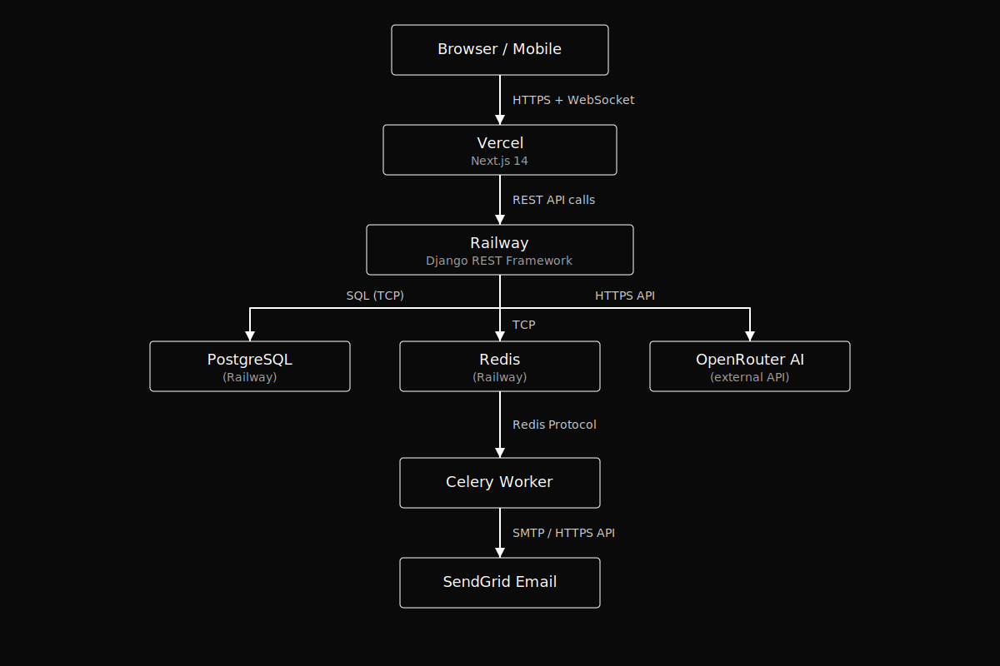

# 🧠 PurpleQuiz AI — AI-Powered Quiz Platform

PurpleQuiz AI is an advanced, agentic education platform that leverages Large Language Models (LLMs) to generate high-quality, personalized quizzes on any topic instantly. Built for real-time social competition and deep learning.

## 🚀 Live Demo
- **Frontend**: [https://rajjjquizai.vercel.app](https://rajjjquizai.vercel.app)
- **Backend API**: [https://quizai-production.up.railway.app](https://quizai-production.up.railway.app)
- **Test Account**: `demo@quizai.com` / `Demo1234!`

---

## 🏗 Architecture


---

## ✨ Features
- **AI Quiz Generation**: Effortlessly generate quizzes via OpenRouter using Mistral 7B.
- **Dynamic Question Types**: Support for both Multiple Choice (MCQ) and AI-evaluated Typed Answer questions.
- **Secure Auth**: JWT authentication with silent token refresh for a seamless session.
- **Social & Competition**: Friend system with online indicators and head-to-head challenges on identical quizzes.
- **Real-time Multiplayer**: Global rooms powered by Django Channels and WebSockets.
- **Analytics & History**: Comprehensive tracking of quiz history, success rates, and global leaderboards.
- **Multi-channel Notifications**: In-app, browser push, and SendGrid email notifications.
- **Public Sharing**: Share results via secure UUID-based public links.
- **Responsive Design**: Premium dark-mode UI that works perfectly on mobile and desktop.

---

## 🛠 How to Run Locally

### Prerequisites
- Node.js 18+
- Python 3.11+
- PostgreSQL
- Redis

### Backend Setup
```bash
git clone https://github.com/PranaavRajV/QuizAI.git
cd QuizAI/backend

python -m venv venv
source venv/bin/activate        # Windows: venv\Scripts\activate
pip install -r requirements.txt

cp .env.example .env
# Fill in values (see Environment Variables section)

python manage.py migrate
python manage.py runserver
```

**Start Celery Worker (In a separate terminal)**
```bash
celery -A quizapp_backend worker -l info
```

### Frontend Setup
```bash
cd ../quizapp_frontend
npm install
cp .env.local.example .env.local
# Set NEXT_PUBLIC_API_URL=http://localhost:8000
npm run dev
```

---

## 🔑 Environment Variables

### Backend (`.env`)
| Key | Description |
| :--- | :--- |
| `SECRET_KEY` | Django secret key |
| `DEBUG` | Set to `True` for local development |
| `DATABASE_URL` | PostgreSQL connection string |
| `REDIS_URL` | Redis connection for Channels/Celery |
| `OPENROUTER_API_KEY` | Key for AI generation |
| `SENDGRID_API_KEY` | Key for email delivery |
| `ALLOWED_HOSTS` | `localhost,127.0.0.1` |
| `CORS_ALLOWED_ORIGINS`| `http://localhost:3000` |

---

## 📊 Database Design Decisions

### Models
- **User**: Extended Django user with last_active, notification preferences, and bio.
- **Quiz**: Topic, difficulty, and `settings` JSONField (timer, points, type).
- **Question/Choice**: Relational structure for MCQ and Typed questions.
- **QuizAttempt**: Stores attempt state, duration, and final scores.
- **Friendship**: Directed relationship row with status (`pending/accepted`).
- **Challenge**: Links two users to a single shared AI-generated Quiz instance.
- **Notification**: User-specific event logs with read tracking.

### Key Decisions
- **Denormalized UserAnswer**: Stores `is_correct` boolean directly to avoid expensive joins during results rendering.
- **Shared Challenge Instance**: Challenger and challenged use the exact same Quiz ID to ensure valid scoring comparisons.
- **UUID Public Tokens**: Public share links use UUIDs to prevent sequential ID enumeration attacks.
- **Leaderboard Caching**: Global results are cached for 5 minutes via Redis to maintain performance under load.

---

## 📡 API Structure

- `POST /api/users/auth/register/` — Create account
- `POST /api/users/auth/login/` — Get JWT tokens
- `GET /api/users/auth/me/` — Get profile + unread counts
- `POST /api/quizzes/` — Generate AI quiz (Rate limited: 10/hr)
- `POST /api/quizzes/{id}/start/` — Begin an attempt
- `POST /api/quizzes/attempts/{id}/submit/` — Single-request bulk answer submission
- `GET /api/social/friends/` — List friends & online status
- `POST /api/social/challenges/` — Send challenge (creates shared quiz)

---

## 🧩 Challenges Faced & Solutions

1. **Submit Reliability**: Refactored the frontend to collect answers in local state and submit a single bulk payload, eliminating 404s and race conditions found in per-question submission.
2. **Challenge Flow Access**: Resolved 403/404 errors for challenged users by extending `QuizViewSet` queryset permissions to include active challenge participants.
3. **OpenRouter Timeouts**: Implemented exponential backoff and simplified fallback prompts for AI generation to handle free-tier latency spikes.
4. **Auth Persistence**: Integrated `localStorage` fallbacks for `attemptId` to prevent data loss during JWT silent-refresh cycles.

---

## ✅ Features Implemented vs Skipped

### Implemented
- [x] Typed answer AI evaluation (Celery)
- [x] Real-time multiplayer (WebSockets)
- [x] Friends comparison on results
- [x] Public UUID-based sharing
- [x] Weekly digest emails

### Skipped
- [ ] **Note Upload**: Critical scope — prioritised robust generation from text prompts first.
- [ ] **Native Mobile App**: Web app is fully responsive; native development requires a separate siloed stack.

---

## 🛠 Tech Stack
- **Frontend**: Next.js 14, Tailwind CSS, Zustand, Axios
- **Backend**: Django 5, DRF, SimpleJWT, Celery, Channels
- **Database**: PostgreSQL, Redis
- **Infra**: Vercel (Front), Railway (Back + DB + Redis)
- **AI**: OpenRouter (Mistral 7B)
